<p align="center">
  
</p>

<p align="center">
  
  
  
</p>

---

## 🌟 Features
- 🕌 **Quran Reader**: Multiple fonts, translations, and audio playback.
- 📿 **Sebha Tracker**: Digital prayer counter with customizable designs.
- 📖 **Azkar Library**: Daily supplications and 99 Names of Allah.
- 🌐 **Multi-Language**: English, French, and more (expandable).
- 🌗 **Dark/Light Mode**: Smooth theme switching.
- 🎧 **Audio Player**: Recitations by famous Shaykhs.
- 🔔 **Notifications**: Reminders for prayers/azkar (Android & iOS).

---

## 🎥 App Preview
<!-- Replace with your GIFs later -->
<p align="center">
  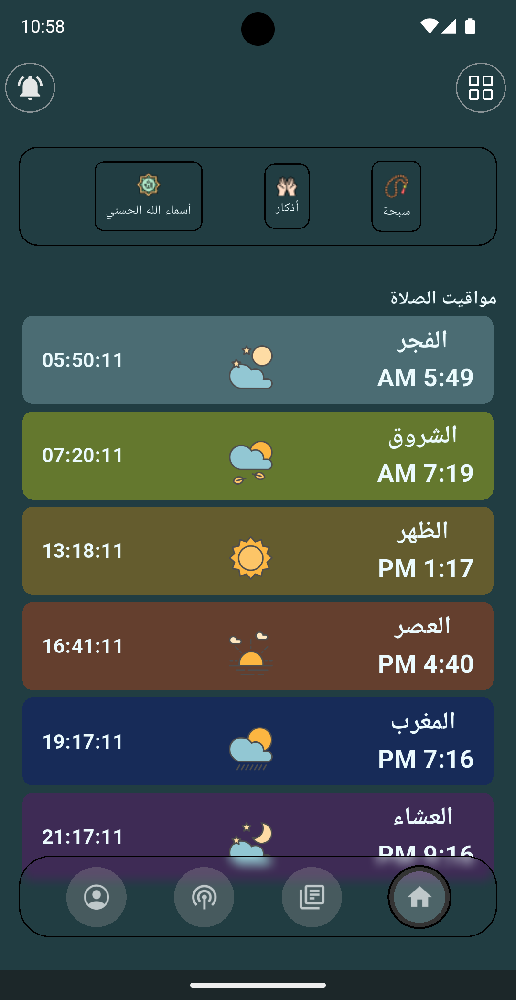
  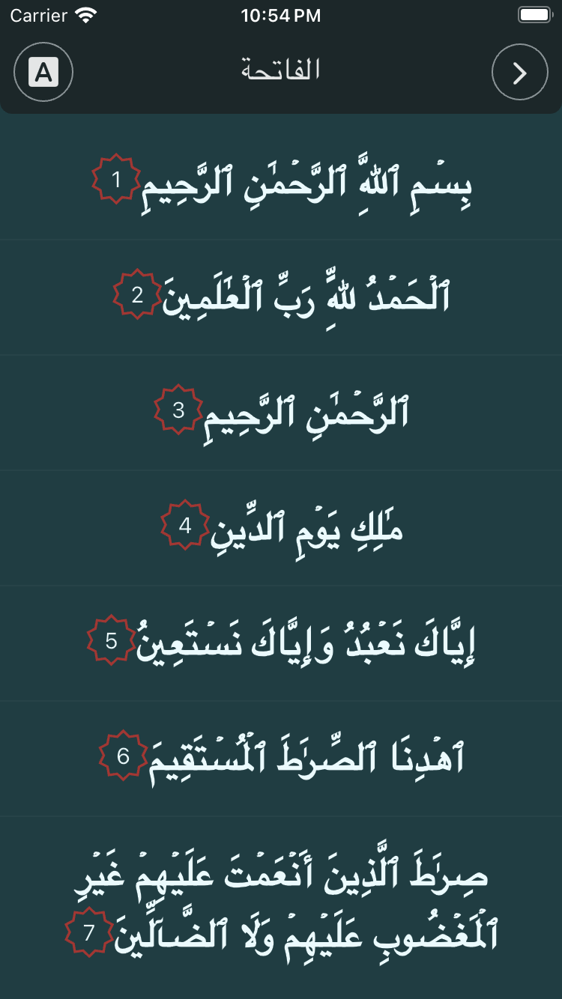
  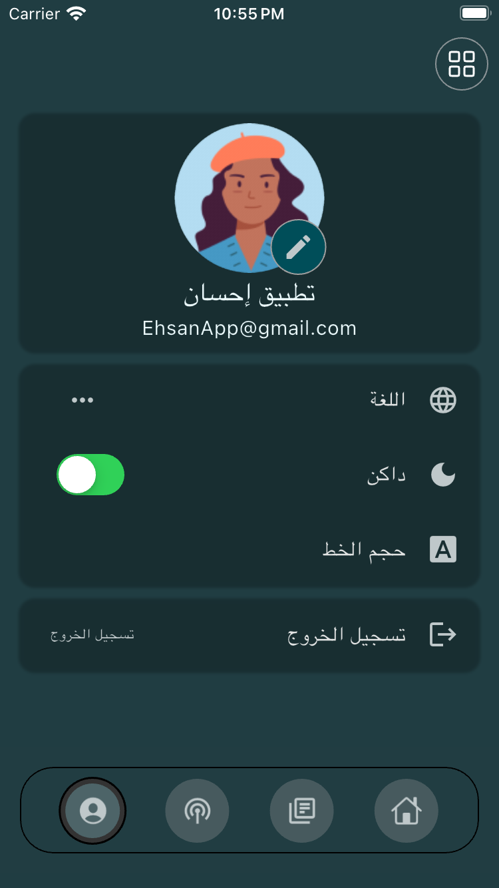
</p>

---

## 📸 Screenshots Gallery
### 🏠 Home Page


### 📿 Sebha Counter
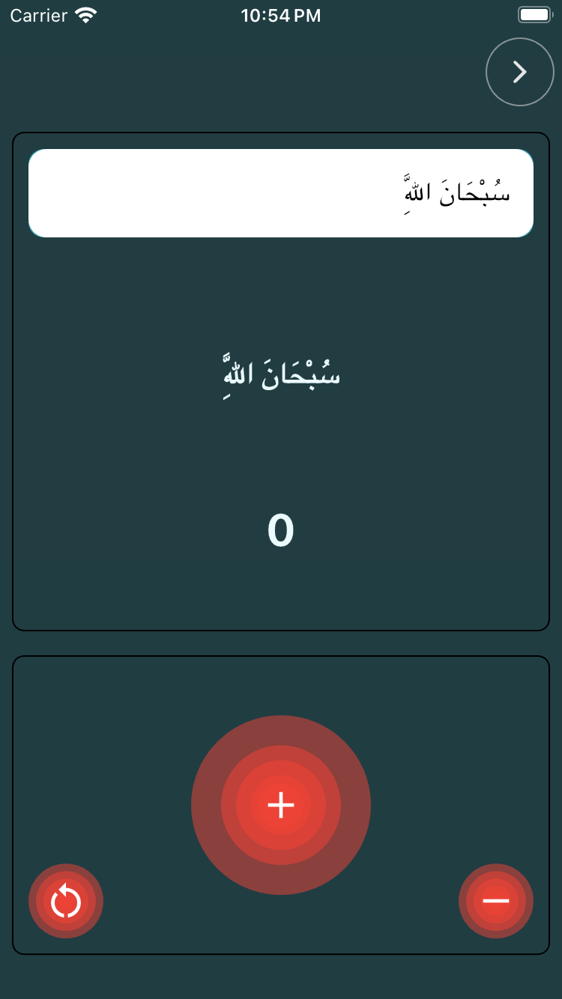
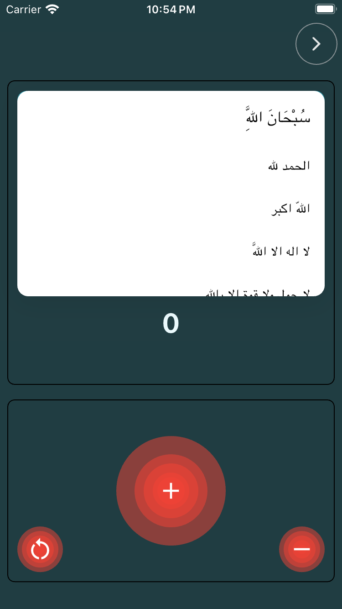

<br clear="left">

### 📖 Azkar & Names of Allah
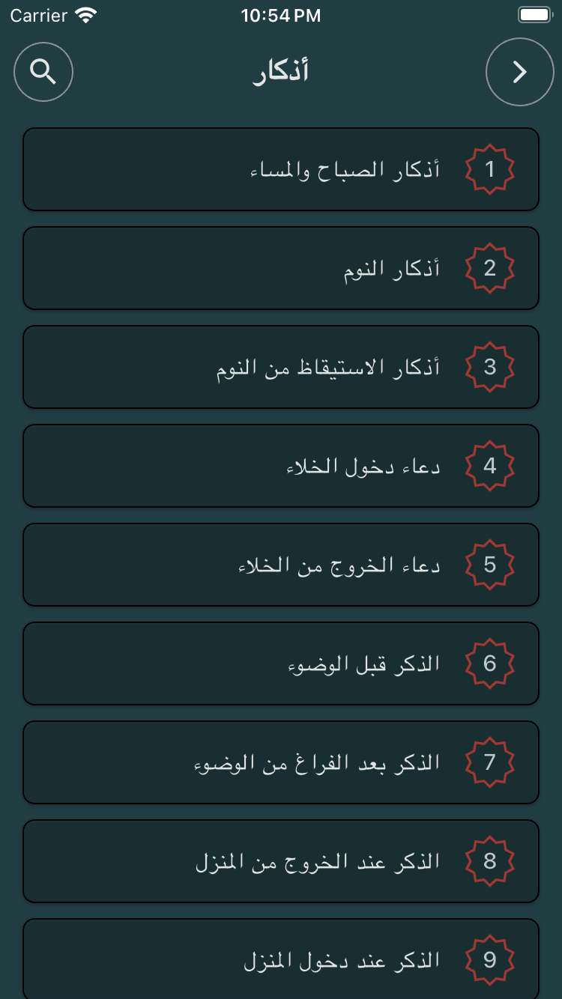
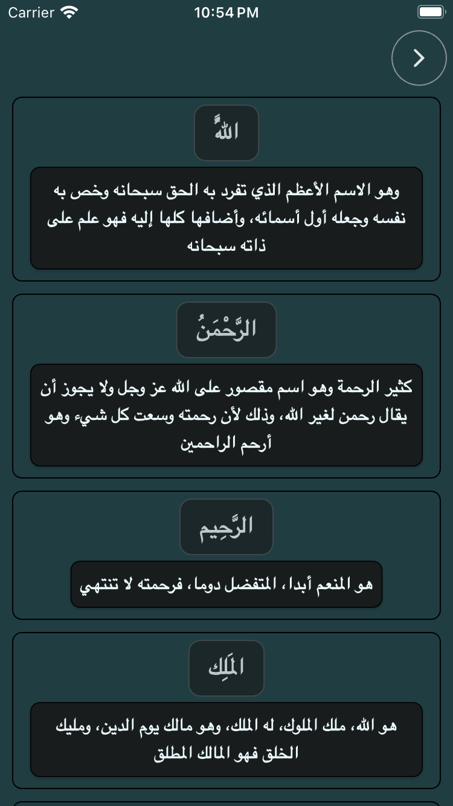

<br clear="left">

### 🕌 Quran Reader
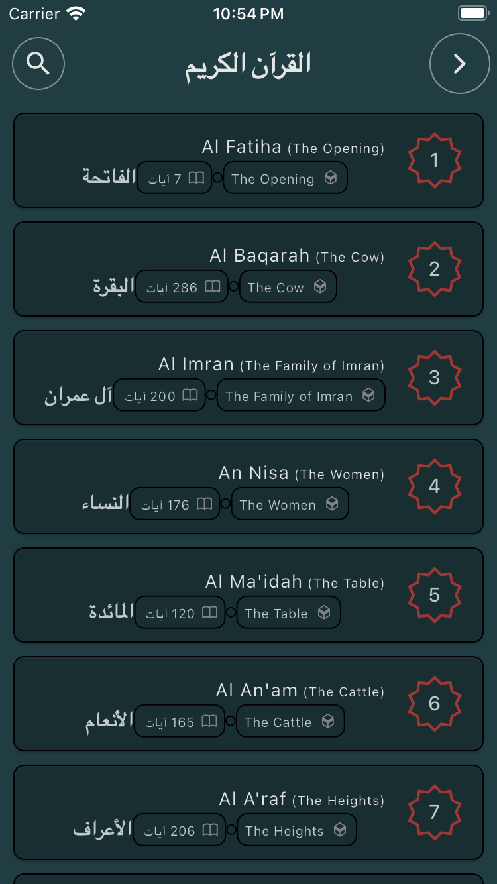

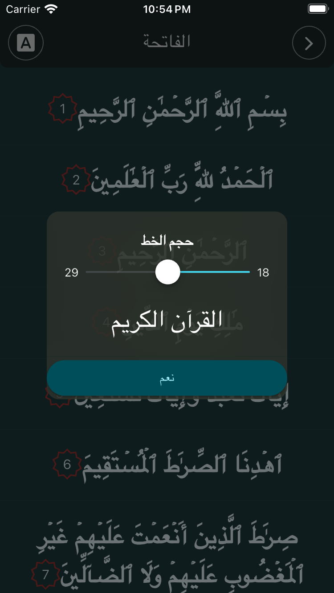

<br clear="left">

### 🌐 Multi-Language Support
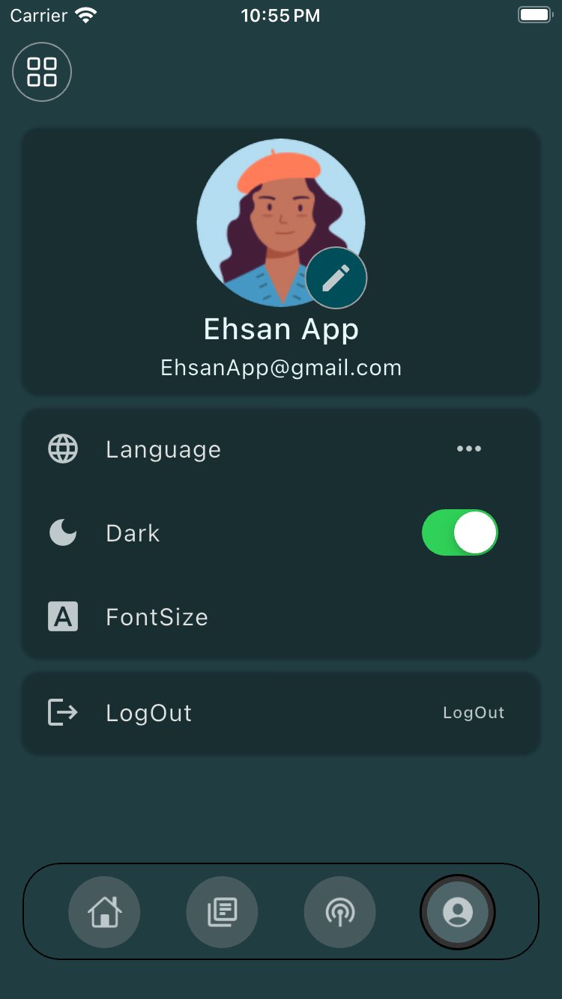
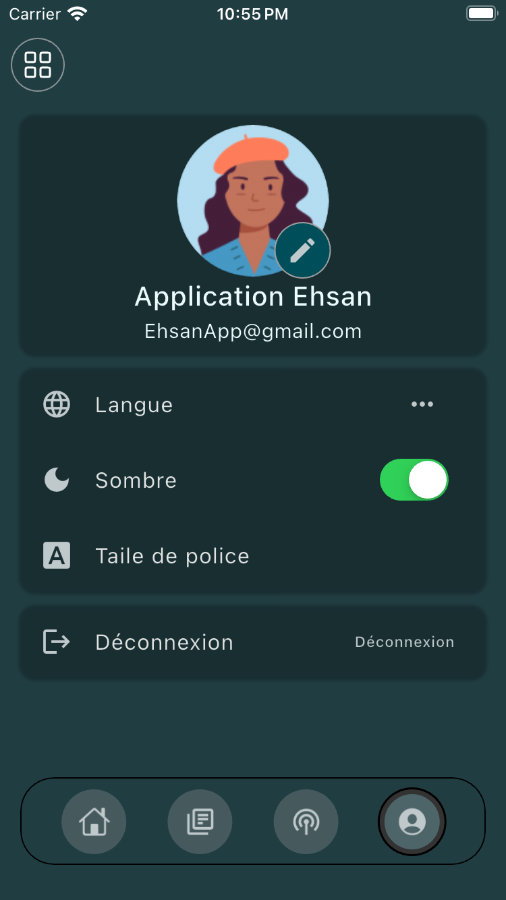

<br clear="left">

---

## 🛠️ Tech Stack
```dart
- Flutter & Dart
- State Management: Bloc Pattern
- Localization: EasyLocalization
- Audio: JustAudio, AudioService
- Notifications: flutter_local_notifications
- Theme: Flexible Dark/Light Mode