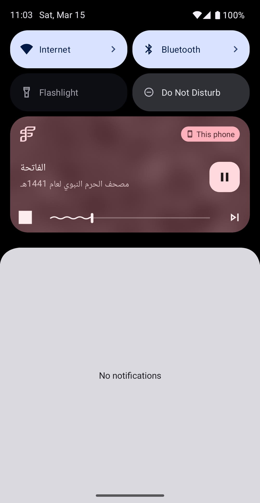

# free_lancer

## Description
A new Flutter project.

### Home Page

### Sebha Page

### Azkar Page

### Asmmaa Allah Page

### Library Page

### Quran Page

### Listen Page

### Youtube Page

### Settings Page (Dark)

### Settings Page (Light)

### Language Widget

### English language

### French language

## Animations
This project includes various animations to enhance user experience. For example:
- **Page transitions**: Smooth transitions between different pages.
- **Button animations**: Animated buttons that provide feedback on user interactions.
